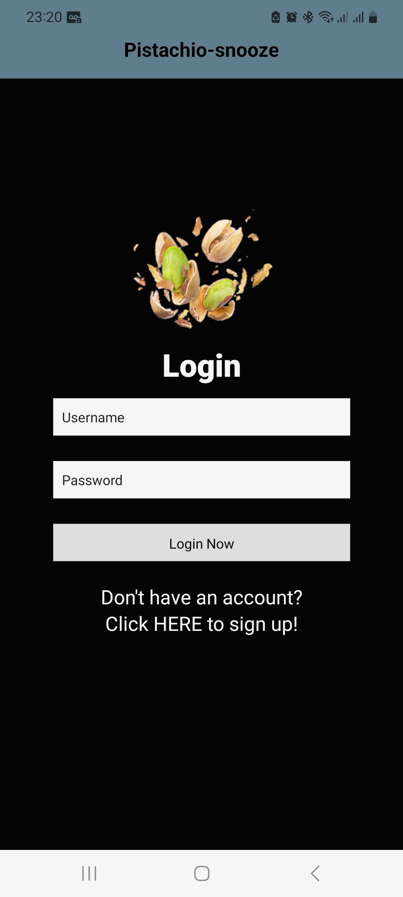

# Pistachio-Snooze

A sleep tracking and monitoring app for use to help combat and track snoring.

The Frontend can be view at [Pistachio Snooze Host]()

## Table of contents

- [Pistachio-Snooze](#pistachio-snooze)
  - [Table of contents](#table-of-contents)
  - [Home Page](#home-page)
  - [General info](#general-info)
  - [Technologies](#technologies)
  - [Run this project locally](#run-this-project-locally)
  - [Design Information](#design-information)

## Home Page

## General info

This is the first stage of a project i have been working on myself.
This app will track, rank and evaluate individuals sleep patterns and snooring intensity, volume and pitch.
The app will display the results in a graph for the user with over time features.
The app will connect to bluetooth devices.

## Technologies

App developed with:

Frontend: React Native, JavaScript, CSS, Axios,

## Run this project locally

1. Fork this repository and clone the fork to your machine.
2. Navigate to client and server files and run
3. `npm install`
4. `npx expo start`

## Design Information

1. Link to ERD [ERD...](https://github.com/webdesignsbytom/webdesignsbytom-app/blob/main/assets/ERD-webdesignsbytom.png)
2. Original Design sketches [Sketch](https://github.com/webdesignsbytom/webdesignsbytom-app/tree/main/assets/design-sketches)
   Phone version has tab options for each field
